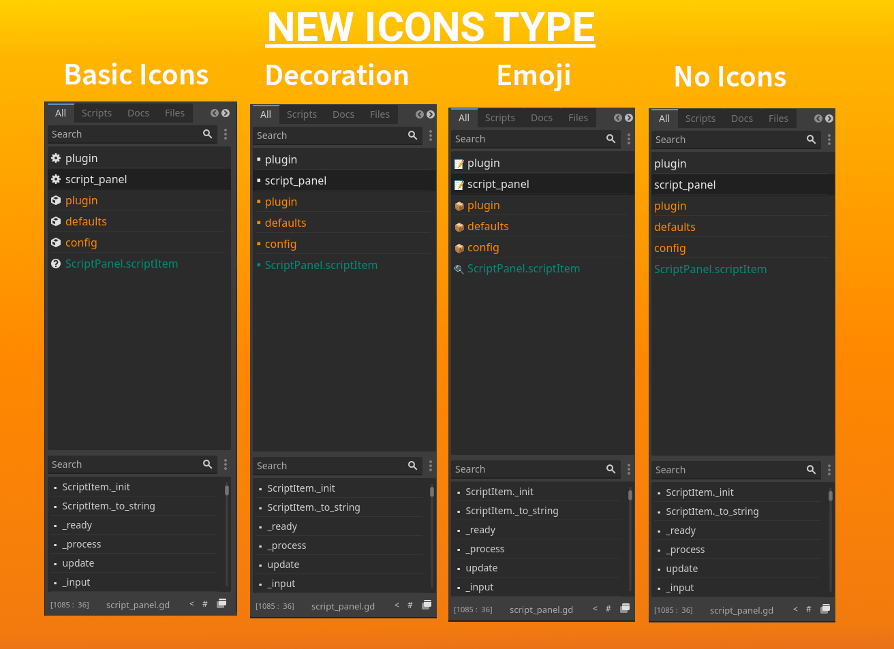

# Script Panel +

If you want more advanced script panel in Godot 4.1, than **“Script Panel Plus”** is for you! It has more features than original. It is highly customizable (check plugins settings for that).

# New Update: Icons!

# 💼 Features:

## All Tab

## Scripts Tab

Scripts tab contains only script item.

## Documentation Tab

Documentation tab contains only Documentation items.

## Favourites Tab

You can toggle any script item **favourite**, and it will appear in the **Favourites** tab. 

## Different Colors

You can choose any color for different types of items (scripts, documentation, files)

## List Resize (**with Ctrl + Mouse Wheel**)

You can resize Font Size with **CTRL key and Mouse Wheel**

## Custom Names (**no effect on file-names**)

You can rename any item in the list without affecting its filesystem name.

## Multiple Columns

## Convert Names to **Pascal/Snake** case

You can turn on automatic **Pascal/Snake** case styling for items.

## Indicators 🔔

- Unsaved-Progress Indicator
  
  

- Error Indicator
  
  

- Locked Script Indicator (**You can lock script's position**)
  
  

### And More... 🧮

---

# Donations 💰

| Type                                                                           | Address                                                                                           |
| ------------------------------------------------------------------------------ | ------------------------------------------------------------------------------------------------- |
|  Bitcoin:  | `bc1qp4w6eelpeu3wfl06a6x0ff8965m56laxfrz0h6`                                                      |
|  Monero:   | `82UM6ztZiCK3wzp1T16WHQ78wm7b2RXzbbStFY75AUDGh2FeXnV5BVMdmQgeL4EyWEaQHVpF6gR244RPGkjsg2hk9dnSQiN` |
|  Ethereum: | `0xcF205d3A5459Aa5dD54376ab878EFFBa18c8934b`                                                      |
