# Script Panel +

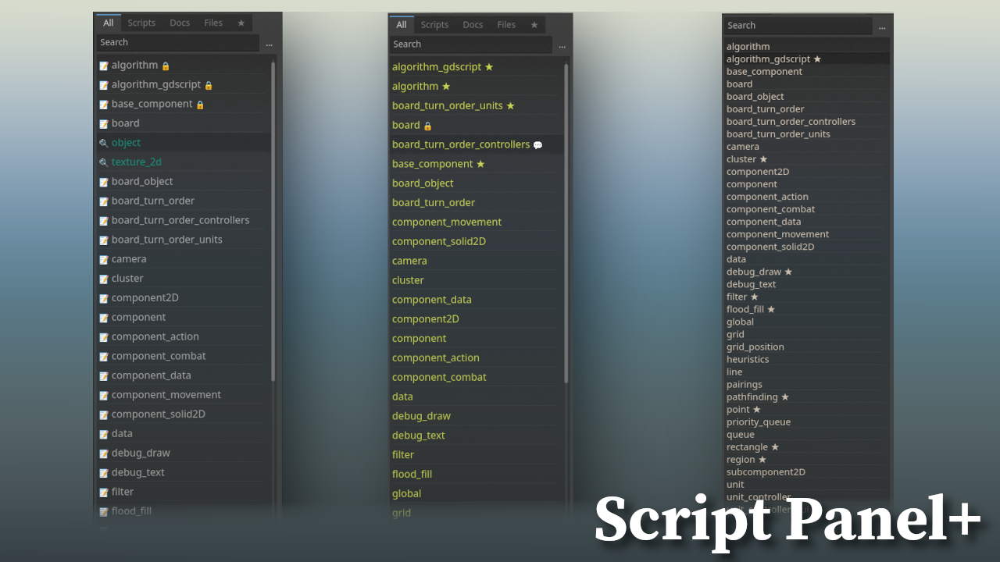

**“Script Panel Plus”** is a replacement plugin for a built-in Godot's scripting panel. It has more features and makes script-organizing a better experience. The plugin's settings allow you to highly customize the panel and hide unnecessary UI-elements. Don't forget to check panel's Project-Settings category.

# 💼 Features:

### Tabs 🗄️

- Scripts Tab
  
  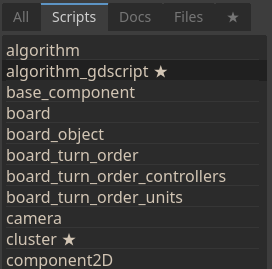

- Documentation Tab
  
  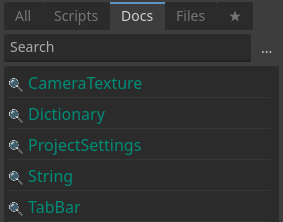

- Favourites Tab
  
  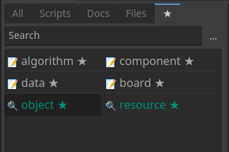

### Look & Feel 🧊

- Script Icons
  
  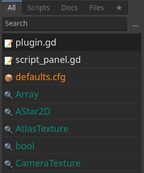

- Script Decorations
  
  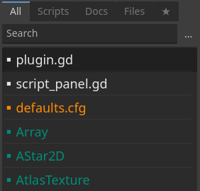

- Different Colors
  
  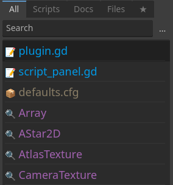

- List Resize (**with Ctrl + Mouse Wheel**)
  
  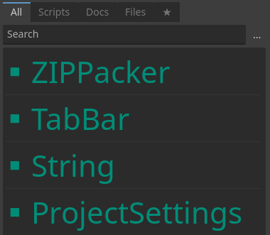

- Custom Names (**no effect on file-names**)
  
  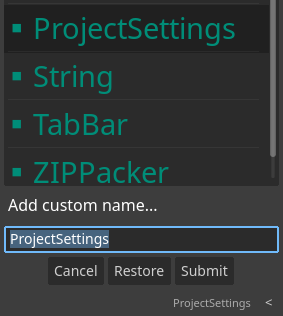

- Multiple Columns
  
  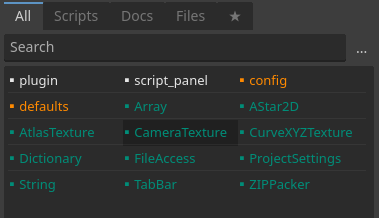

- Convert Names to **Pascal/Snake** case
  
  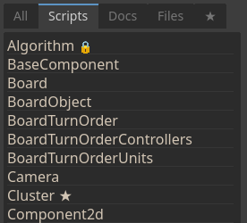

### Indicators 🔔

- Unsaved-Progress Indicator
  
  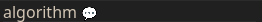

- Error Indicator
  
  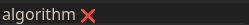

- Locked Script Indicator (**You can lock script's position**)
  
  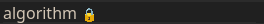

### 

### And More... 🧮

---

# Donations 💰

| Type                                                                           | Address                                                                                           |
| ------------------------------------------------------------------------------ | ------------------------------------------------------------------------------------------------- |
|  Bitcoin:  | `bc1qp4w6eelpeu3wfl06a6x0ff8965m56laxfrz0h6`                                                      |
|  Monero:   | `82UM6ztZiCK3wzp1T16WHQ78wm7b2RXzbbStFY75AUDGh2FeXnV5BVMdmQgeL4EyWEaQHVpF6gR244RPGkjsg2hk9dnSQiN` |
|  Ethereum: | `0xcF205d3A5459Aa5dD54376ab878EFFBa18c8934b`                                                      |
